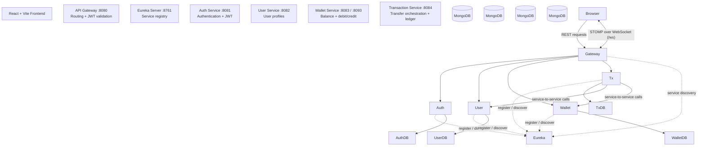

PayVault
Fault-Tolerant Digital Wallet & Real-Time Financial Ledger System
PayVault is a microservices-based digital wallet application built with React, Spring Boot, MongoDB, Eureka, and Spring Cloud Gateway. It demonstrates service separation, service discovery, JWT-based authentication, gateway routing, wallet operations, transaction processing, and real-time dashboard updates.
> \*\*Project scope:\*\* This README documents the existing project and its current technology stack and startup process. It does not describe a planned database migration or removal of existing services.
---
1. Problem Analysis & Requirement Specification
Problem statement
A digital wallet needs to support users and wallet operations while keeping transaction processing consistent and providing a clear record of financial activity. A monolithic implementation can make it harder to separate responsibilities and scale individual parts of the application.
PayVault addresses this by separating authentication, user profiles, wallet operations, and transaction orchestration into independent backend services. Eureka provides service discovery, while the API Gateway acts as the common entry point for frontend requests.
Core requirements represented in the application
Users can authenticate through the authentication service using JWT.
User profile information is handled by a dedicated user service.
Wallet balance and debit/credit operations are handled by the wallet service.
Transfers and transaction/ledger records are handled by the transaction service.
Backend services register with Eureka for service discovery.
The API Gateway routes incoming requests to the appropriate backend service.
The dashboard can receive transfer updates through WebSocket/STOMP when connected.
MongoDB is used for service persistence.
---
2. Technology Stack
Layer	Technologies
Frontend	React, Vite, React Router, Axios, Tailwind CSS
Backend	Java 17, Spring Boot 3.3
Microservices infrastructure	Spring Cloud 2023.0, Eureka, Spring Cloud Gateway, OpenFeign, LoadBalancer
Database	MongoDB — one logical database per service
Build and runtime	Maven multi-module build, Docker, Docker Compose
Real-time communication	STOMP over WebSocket
---
3. Microservice Identification & Service Discovery
PayVault contains six backend modules. Each service has a defined responsibility:
Service/module	Responsibility
Eureka Server (`eureka-server`)	Service registry. Backend services register here, and service clients can discover registered instances.
API Gateway (`api-gateway`)	Common entry point for client requests; routes requests to backend services and includes gateway-side JWT validation.
Auth Service (`auth-service`)	Handles authentication and JWT creation.
User Service (`user-service`)	Handles user profile data.
Wallet Service (`wallet-service`)	Handles wallet balances and debit/credit operations. Supports multiple instances registered under the same logical service name.
Transaction Service (`transaction-service`)	Orchestrates transfers and maintains transaction/ledger-related records.
Service discovery and load balancing
Services use Eureka registration/discovery rather than relying exclusively on hardcoded instance addresses. The Wallet Service can run as two instances under the `WALLET-SERVICE` service name. Calls resolved through Eureka and Spring Cloud LoadBalancer can be distributed across those instances.
---
4. JWT Authentication
JWT is used for authenticated access:
The client submits authentication details to the Auth Service.
The Auth Service handles authentication and issues a JWT.
The client includes the token with requests that require authentication.
The API Gateway validates JWTs as part of gateway request handling before routing protected requests onward.
The WebSocket/STOMP connection authenticates on the STOMP `CONNECT` frame rather than the WebSocket handshake. The gateway's `JwtAuthenticationFilter` and the transaction service's `StompAuthChannelInterceptor` participate in this flow.
---
5. API Gateway Configuration
The API Gateway is the frontend's backend entry point, running on port 8080 by default. Its routes target the registered service names, including:
`AUTH-SERVICE`
`USER-SERVICE`
`WALLET-SERVICE`
`TRANSACTION-SERVICE`
The gateway also contains a WebSocket route for the transaction service. Service discovery and load balancing allow routes to resolve service instances through Eureka.
---
6. System Architecture

Architecture notes
Client access: The React frontend sends backend requests through the API Gateway.
Service registry: Eureka maintains the registry used for service discovery.
Service responsibilities: Authentication, user data, wallet operations, and transaction processing are separated into their respective services.
Persistence: MongoDB is used by the business services, with one logical database per service.
Wallet scaling: Two Wallet Service instances can register under the same service name for load balancing.
Real-time behavior: The dashboard uses WebSocket/STOMP for live updates. REST remains the source of truth; live delivery is fire-and-forget, so users can retrieve current state through REST after reconnecting.
---
7. Project Structure
```text
payvault/
├── pom.xml
├── eureka-server/
├── api-gateway/
├── auth-service/
├── user-service/
├── wallet-service/
├── transaction-service/
└── frontend/
```
---
8. Prerequisites
JDK 17+
Maven 3.9+
Node.js 18+ and npm (for the frontend)
Docker and Docker Compose (for the full Docker-based stack or MongoDB)
---
9. Running Multiple Wallet Service Instances
Wallet Service can run as two instances sharing the same MongoDB database and registering under `WALLET-SERVICE` in Eureka:
```bash
mvn -pl wallet-service -am spring-boot:run
mvn -pl wallet-service -am spring-boot:run -Dspring-boot.run.profiles=dev,instance2
```
The configured instances use ports 8083 and 8093. Both should appear under one `WALLET-SERVICE` entry on the Eureka dashboard at port `8761`. Responses include an `X-Served-By: wallet-service:<port>` header, which can be used to observe which instance handled a request.
---
10. Running Everything with Docker
From the project root:
```bash
cp .env.example .env
```
Fill in a real `JWT\_SECRET` in `.env`, then run:
```bash
docker compose up --build
```
For later starts, when images already exist and no rebuild is needed:
```bash
docker compose up
```
Docker Compose health checks coordinate startup: MongoDB and Eureka start first, followed by the business services, the Gateway, and the frontend.
URLs
Component	URL
Frontend	http://localhost:5174
API Gateway	http://localhost:8080
Eureka dashboard	http://localhost:8761
Useful Docker commands:
```bash
docker compose ps
docker compose logs -f api-gateway
```
Stop the stack while preserving data:
```bash
docker compose down
```
Stop the stack and remove the MongoDB volume:
```bash
docker compose down -v
```
Environment note: `VITE\_API\_BASE\_URL` and `FRONTEND\_ORIGIN` remain configured for `localhost` because frontend JavaScript runs in the browser and reaches the Gateway through its host-published port. Inter-service URLs such as Eureka and MongoDB use container hostnames within the Docker network.
---
11. Running Services Manually
This alternative is useful during active development. Start MongoDB first:
```bash
docker compose up -d mongodb
```
Then run the backend modules from the project root, in this order:
```bash
mvn -pl eureka-server -am spring-boot:run
mvn -pl user-service -am spring-boot:run
mvn -pl wallet-service -am spring-boot:run
mvn -pl auth-service -am spring-boot:run
mvn -pl transaction-service -am spring-boot:run
mvn -pl api-gateway -am spring-boot:run
```
Finally, start the frontend:
```bash
cd frontend
npm install
npm run dev
```
The frontend is available at `http://localhost:5174`, the Gateway at `http://localhost:8080`, and Eureka at `http://localhost:8761`.
---
12. Testing
Run individual service tests from the project root:
```bash
mvn -pl wallet-service test
mvn -pl transaction-service test
mvn -pl auth-service test
mvn -pl user-service test
mvn -pl api-gateway test
```
Run the full suite:
```bash
mvn test
```
Test coverage described by the project
Unit tests: Exercise service logic in isolation using mocked collaborators, including validation, exception mapping, idempotency branches, and compensation behavior.
`WalletConcurrencyIT`: Uses a real MongoDB instance through Testcontainers to check concurrent debits and the insufficient-balance guard.
`TransactionTransferIT`: Exercises the transfer HTTP/persistence flow with MongoDB through Testcontainers, including idempotency behavior.
Requirement: The integration tests using Testcontainers require a working Docker daemon available to the JVM. The Eureka Server has no custom logic described for unit testing. Gateway routing and CORS configuration are not covered by a dedicated automated gateway filter-chain test in the current test scope.
---
13. Review Rubric Alignment
This section maps the existing application to the software-related rubric areas. It describes the implementation and its purpose rather than assigning scores.
Rubric area	PayVault implementation / evidence
Problem Analysis & Requirement Specification	Defines the digital wallet problem and the core needs for authentication, profiles, wallet operations, transaction records, service discovery, and client access.
Microservice Identification & Service Discovery	Identifies the six backend modules by responsibility and uses Eureka for registration/discovery; Wallet Service supports multiple registered instances.
JWT Authentication	Auth Service handles authentication and token issuance; gateway-side JWT validation protects routed requests.
API Gateway Configuration	Gateway provides a common entry point and routes to the Auth, User, Wallet, and Transaction services using service names. A WebSocket route is also configured.
LinkedIn Article with DTI Concepts & Review	This is a separate submission/activity item and is not represented as an application feature in this README.
MOOC Certificate Progress	This is a separate progress/submission item and is not represented as an application feature in this README.
---
14. Development Roadmap / Implemented Phases
The project README records the following phases as complete:
Phase	Work
1	Project setup
2	Eureka Server
3	User Service
4	Auth Service + JWT
5	Wallet Service
6	Transaction Service
7	API Gateway
8	Load balancing
9	Fault tolerance
10	Frontend
11	Real-time updates
12	Docker
13	Testing
