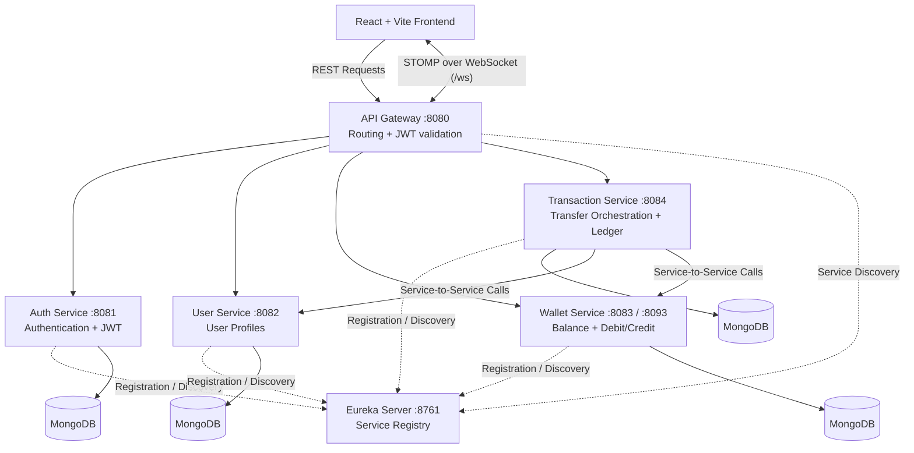

# PayVault

### Fault-Tolerant Digital Wallet & Real-Time Financial Ledger System

PayVault is a microservices-based digital wallet application built with React, Spring Boot, MongoDB, Eureka, and Spring Cloud Gateway. It demonstrates service separation, service discovery, JWT-based authentication, gateway routing, wallet operations, transaction processing, and real-time dashboard updates.

> **Project scope:** This README documents the existing project, technology stack, services, and startup process. It does not describe planned database migrations or service removals as completed.

---

## 1. Problem Analysis & Requirement Specification

### Problem Statement

A digital wallet application needs to support users and wallet operations while maintaining transaction records and providing a clear view of financial activity. Separating application responsibilities into microservices helps organize the system into independently managed components.

PayVault addresses this by separating authentication, user profiles, wallet operations, and transaction orchestration into dedicated backend services. Eureka supports service discovery, while the API Gateway provides a common entry point for frontend requests.

### Core Requirements

* Authenticate users through the Auth Service using JWT.
* Manage user profile information through the User Service.
* Handle wallet balances and debit/credit operations through the Wallet Service.
* Process transfers and maintain transaction/ledger-related records through the Transaction Service.
* Register backend services with Eureka for service discovery.
* Route frontend requests through the API Gateway.
* Support real-time dashboard updates through WebSocket/STOMP.
* Persist service data using MongoDB.

---

## 2. Technology Stack

| Layer                        | Technologies                                                               |
| ---------------------------- | -------------------------------------------------------------------------- |
| Frontend                     | React, Vite, React Router, Axios, Tailwind CSS                             |
| Backend                      | Java 17, Spring Boot 3.3                                                   |
| Microservices Infrastructure | Spring Cloud 2023.0, Eureka, Spring Cloud Gateway, OpenFeign, LoadBalancer |
| Database                     | MongoDB — one logical database per service                                 |
| Build and Runtime            | Maven multi-module build, Docker, Docker Compose                           |
| Real-Time Communication      | STOMP over WebSocket                                                       |

---

## 3. Microservice Identification & Service Discovery

PayVault contains six backend modules, each with a defined responsibility.

| Service                                         | Responsibility                                                                                                                     |
| ----------------------------------------------- | ---------------------------------------------------------------------------------------------------------------------------------- |
| **Eureka Server** (`eureka-server`)             | Maintains the service registry. Backend services register with Eureka, allowing service instances to be discovered.                |
| **API Gateway** (`api-gateway`)                 | Acts as the common entry point for client requests, routes requests to backend services, and includes gateway-side JWT validation. |
| **Auth Service** (`auth-service`)               | Handles user authentication and JWT creation.                                                                                      |
| **User Service** (`user-service`)               | Manages user profile data.                                                                                                         |
| **Wallet Service** (`wallet-service`)           | Handles wallet balances and debit/credit operations. Supports multiple instances registered under the same logical service name.   |
| **Transaction Service** (`transaction-service`) | Orchestrates transfers and maintains transaction/ledger-related records.                                                           |

### Service Discovery and Load Balancing

Backend services use Eureka registration and discovery rather than depending exclusively on hardcoded instance addresses.

The Wallet Service supports multiple instances registered under the `WALLET-SERVICE` name. Eureka and Spring Cloud LoadBalancer can resolve and distribute service calls across the registered instances.

---

## 4. JWT Authentication

PayVault uses JSON Web Tokens (JWT) for authenticated access.

### Authentication Flow

1. The client submits authentication details to the Auth Service.
2. The Auth Service handles authentication and issues a JWT.
3. The client includes the token in requests that require authentication.
4. The API Gateway validates JWTs as part of request handling before routing protected requests to backend services.

### WebSocket Authentication

The WebSocket/STOMP connection authenticates on the STOMP `CONNECT` frame rather than during the WebSocket handshake.

The gateway's `JwtAuthenticationFilter` and the transaction service's `StompAuthChannelInterceptor` participate in this authentication flow.

---

## 5. API Gateway Configuration

The API Gateway acts as the common entry point for frontend requests and runs on port **8080** by default.

Its routes target the following registered service names:

* `AUTH-SERVICE`
* `USER-SERVICE`
* `WALLET-SERVICE`
* `TRANSACTION-SERVICE`

The Gateway also contains a WebSocket route for the Transaction Service.

Service discovery and load balancing allow routes to resolve service instances through Eureka.

---

## 6. System Architecture



### Architecture Explanation

* **Frontend:** The React application provides the user interface and sends backend requests through the API Gateway.
* **API Gateway:** Provides a single entry point for routing requests to the appropriate backend services and performs gateway-side JWT validation.
* **Eureka Server:** Maintains the service registry used by services and clients for service discovery.
* **Auth Service:** Handles authentication and JWT issuance.
* **User Service:** Manages user profile information.
* **Wallet Service:** Handles wallet balances and debit/credit operations.
* **Transaction Service:** Coordinates transfers and maintains transaction/ledger-related records.
* **MongoDB:** Provides persistence for the business services, with one logical database per service.
* **Load Balancing:** Multiple Wallet Service instances can register under the same service name and be resolved through Eureka and Spring Cloud LoadBalancer.
* **Real-Time Updates:** The dashboard receives updates through WebSocket/STOMP. REST endpoints remain the source of truth; live delivery is fire-and-forget, so users can retrieve the current state through REST.

---

## 7. Project Structure

```text
payvault/
├── pom.xml
├── eureka-server/
├── api-gateway/
├── auth-service/
├── user-service/
├── wallet-service/
├── transaction-service/
└── frontend/
```

---

## 8. Prerequisites

* JDK 17+
* Maven 3.9+
* Node.js 18+ and npm (for the frontend)
* Docker and Docker Compose (for the full Docker-based stack or MongoDB)

---

## 9. Running Multiple Wallet Service Instances

Wallet Service can run as two instances sharing the same MongoDB database and registering under `WALLET-SERVICE` in Eureka.

```bash
mvn -pl wallet-service -am spring-boot:run
mvn -pl wallet-service -am spring-boot:run -Dspring-boot.run.profiles=dev,instance2
```

The configured instances use ports **8083** and **8093**.

Both should appear under one `WALLET-SERVICE` entry on the Eureka dashboard at port `8761`.

Responses include an `X-Served-By: wallet-service:<port>` header, which can be used to observe which instance handled a request.

---

## 10. Running Everything with Docker

From the project root:

```bash
cp .env.example .env
```

Fill in a real `JWT_SECRET` in `.env`, then run:

```bash
docker compose up --build
```

For later starts, when images already exist and no rebuild is needed:

```bash
docker compose up
```

Docker Compose health checks coordinate startup. MongoDB and Eureka start first, followed by the business services, the Gateway, and the frontend.

### URLs

| Component        | URL                   |
| ---------------- | --------------------- |
| Frontend         | http://localhost:5174 |
| API Gateway      | http://localhost:8080 |
| Eureka Dashboard | http://localhost:8761 |

### Useful Docker Commands

Check service status:

```bash
docker compose ps
```

View service logs:

```bash
docker compose logs -f api-gateway
```

Stop the stack while preserving data:

```bash
docker compose down
```

Stop the stack and remove the MongoDB volume:

```bash
docker compose down -v
```

### Environment Configuration Note

`VITE_API_BASE_URL` and `FRONTEND_ORIGIN` remain configured for `localhost` because frontend JavaScript runs in the browser and reaches the Gateway through its host-published port.

Other inter-service URLs, such as Eureka and MongoDB, use container hostnames because those calls happen within the Docker network.

---

## 11. Running Services Manually

Running services individually with Maven is useful during active development.

Start MongoDB first:

```bash
docker compose up -d mongodb
```

Then run the backend modules from the project root, in this order:

### 1. Eureka Server

```bash
mvn -pl eureka-server -am spring-boot:run
```

### 2. User Service

```bash
mvn -pl user-service -am spring-boot:run
```

### 3. Wallet Service

```bash
mvn -pl wallet-service -am spring-boot:run
```

### 4. Auth Service

```bash
mvn -pl auth-service -am spring-boot:run
```

### 5. Transaction Service

```bash
mvn -pl transaction-service -am spring-boot:run
```

### 6. API Gateway

```bash
mvn -pl api-gateway -am spring-boot:run
```

### 7. Frontend

Open a terminal inside the `frontend` directory:

```bash
npm install
npm run dev
```

### Local URLs

| Component        | URL                   |
| ---------------- | --------------------- |
| Frontend         | http://localhost:5174 |
| API Gateway      | http://localhost:8080 |
| Eureka Dashboard | http://localhost:8761 |

---

## 12. Testing

Run individual service tests from the project root:

```bash
mvn -pl wallet-service test
mvn -pl transaction-service test
mvn -pl auth-service test
mvn -pl user-service test
mvn -pl api-gateway test
```

Run the full test suite:

```bash
mvn test
```

### Test Coverage

* **Unit tests:** Test service logic in isolation using mocked collaborators. Coverage includes validation, exception mapping, idempotency branches, and compensation behavior.
* **`WalletConcurrencyIT`:** Uses a real MongoDB instance through Testcontainers to check concurrent debits and the insufficient-balance guard.
* **`TransactionTransferIT`:** Exercises the transfer HTTP and persistence flow with MongoDB through Testcontainers, including idempotency behavior.

### Testing Requirements and Scope

The integration tests using Testcontainers require a working Docker daemon available to the JVM.

The Eureka Server has no custom logic described for unit testing. Gateway routing and CORS configuration are not covered by a dedicated automated gateway filter-chain test in the current test scope.

---

## 13. Review Rubric Alignment

This section maps the existing application to the software-related review rubric.

| Rubric Category                                     | PayVault Implementation                                                                                                                                                    |
| --------------------------------------------------- | -------------------------------------------------------------------------------------------------------------------------------------------------------------------------- |
| **Problem Analysis & Requirement Specification**    | Describes the digital wallet problem and the requirements for authentication, user profiles, wallet operations, transaction records, service discovery, and client access. |
| **Microservice Identification & Service Discovery** | Identifies the six backend modules by responsibility and uses Eureka for registration and discovery. Wallet Service supports multiple registered instances.                |
| **JWT Authentication**                              | Auth Service handles authentication and token issuance. Gateway-side JWT validation is used for request handling.                                                          |
| **API Gateway Configuration**                       | Gateway provides a common entry point and routes requests to Auth, User, Wallet, and Transaction services using service names. A WebSocket route is also configured.       |
| **LinkedIn Article with DTI Concepts & Review**     | This is a separate submission/activity item and is not represented as an application feature in this README.                                                               |
| **MOOC Certificate Progress**                       | This is a separate progress/submission item and is not represented as an application feature in this README.                                                               |

---

## 14. Development Roadmap

The project records the following development phases:

| Phase | Work                |
| ----- | ------------------- |
| 1     | Project setup       |
| 2     | Eureka Server       |
| 3     | User Service        |
| 4     | Auth Service + JWT  |
| 5     | Wallet Service      |
| 6     | Transaction Service |
| 7     | API Gateway         |
| 8     | Load balancing      |
| 9     | Fault tolerance     |
| 10    | Frontend            |
| 11    | Real-time updates   |
| 12    | Docker              |
| 13    | Testing             |
